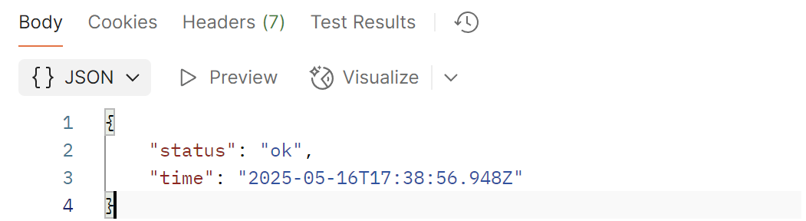
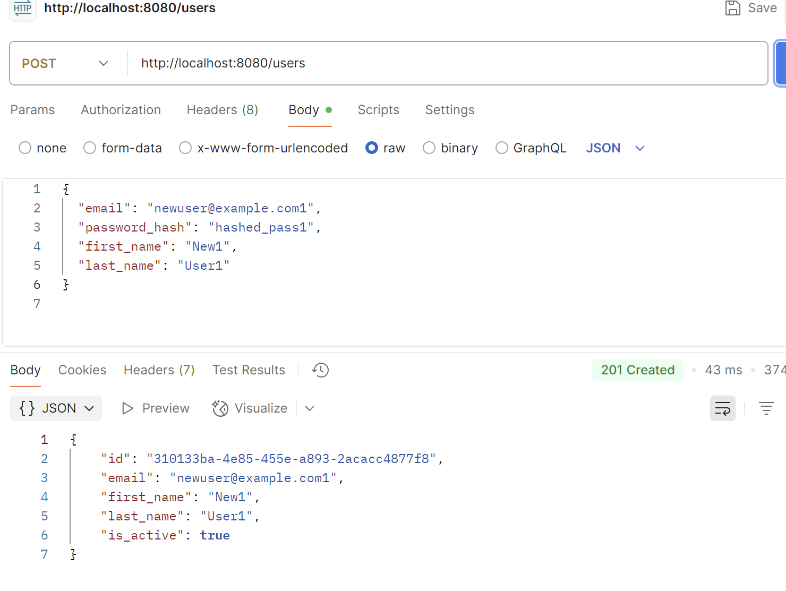
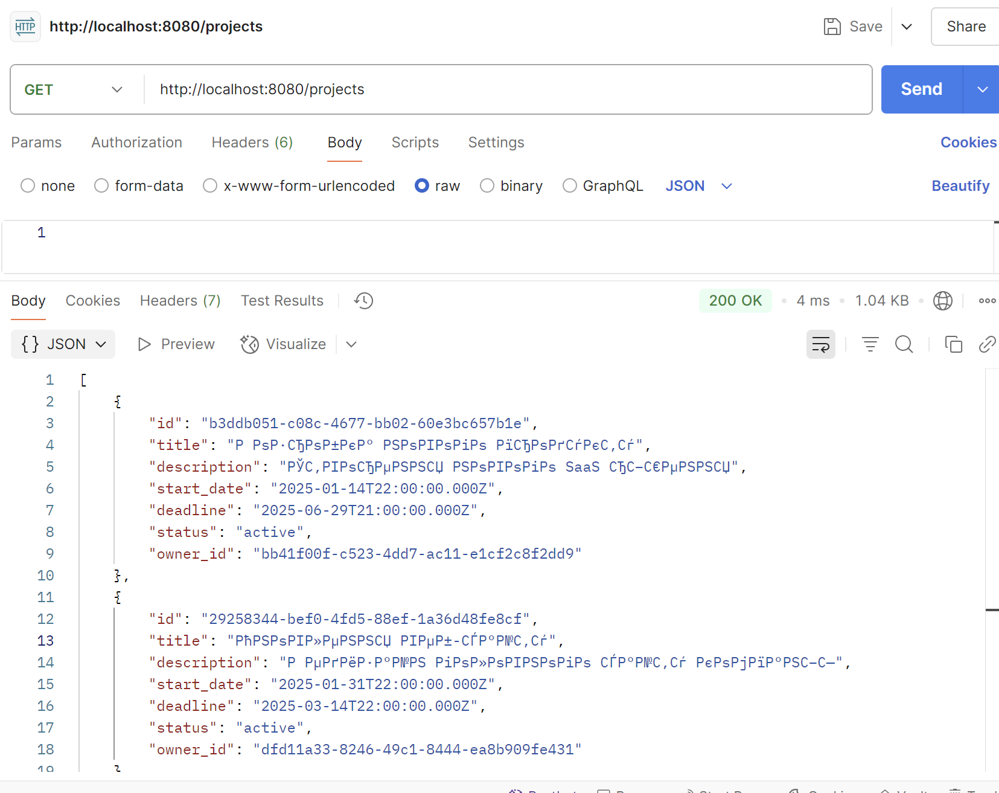
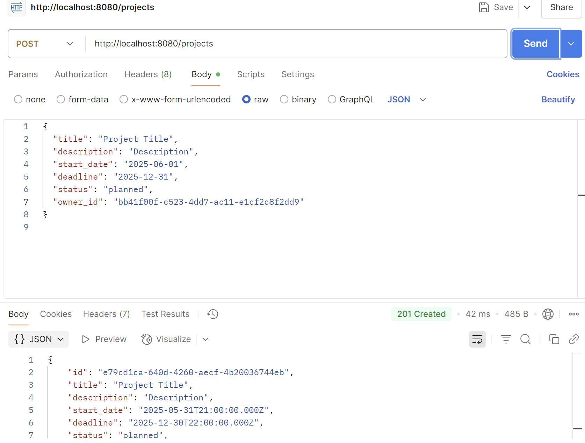
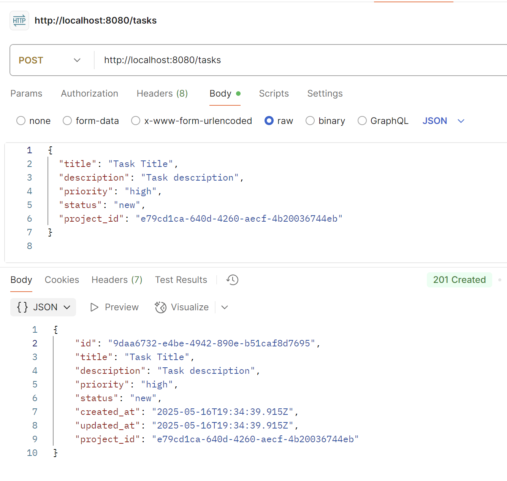
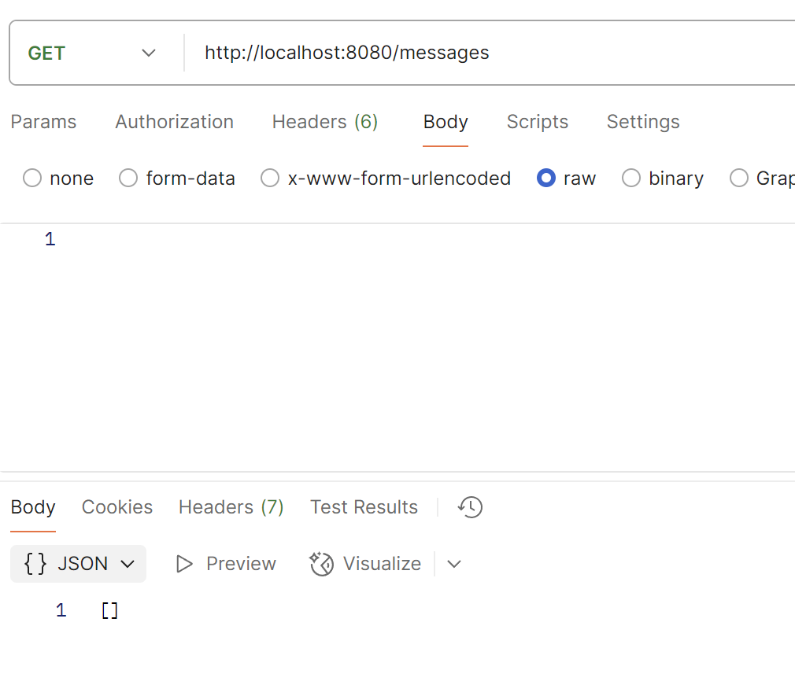
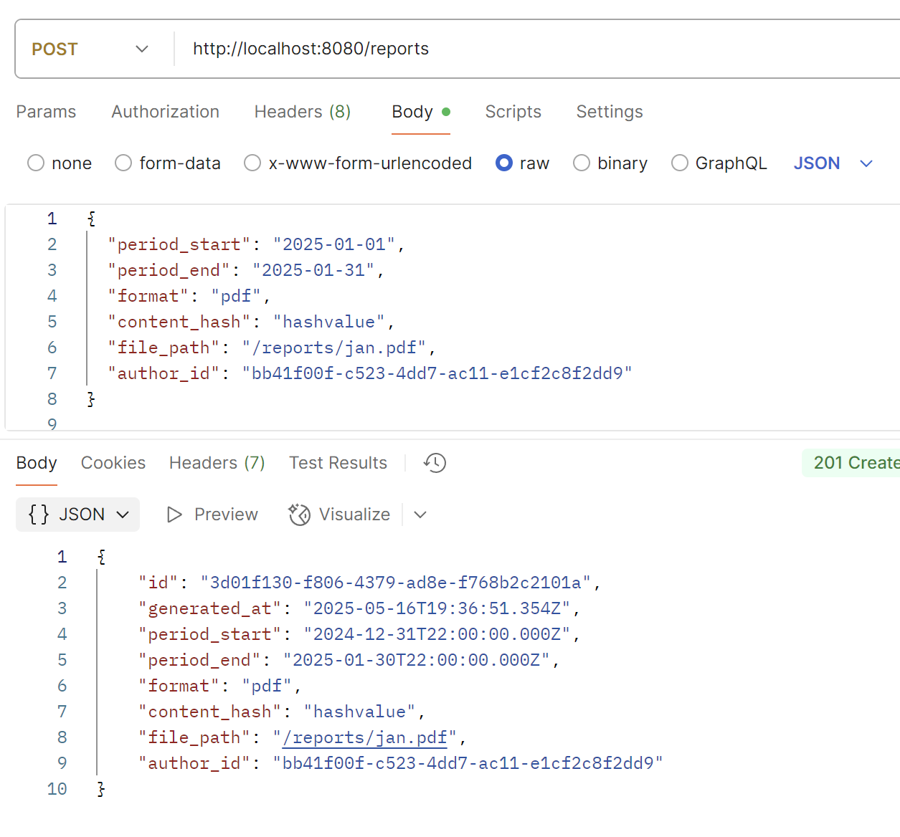

# API Tests Documentation

This document contains a collection of API tests for database endpoints.

## Table of Contents
- [Health Check](#health-check)
- [Users](#users)
  - [Get All Users](#get-all-users)
  - [Create User](#create-user)
- [Projects](#projects)
  - [Get Projects](#get-projects)
  - [Create Project](#create-project)
- [Tasks](#tasks)
  - [Get Tasks](#get-tasks)
  - [Create Task](#create-task)
- [Messages](#messages)
  - [Get Messages](#get-messages)
- [Reports](#reports)
  - [Create Report](#create-report)

## Health Check

**Method:** GET

**URL:** http://localhost:8080/health

**Expected Status Code:** 200

**Response Body:**
```json
{
  "status": "ok",
  "time": "2025-05-16T13:00:00Z"
}
```


## Users

### Get All Users

**Method:** GET

**URL:** http://localhost:8080/users

**Expected Status Code:** 200

**Response Body (array of users):**
```json
[
  {
    "id": "uuid-1",
    "email": "admin@company.com",
    "first_name": "Іван",
    "last_name": "Петренко",
    "is_active": true
  },
  {
    "id": "uuid-2",
    "email": "manager@company.com",
    "first_name": "Марія",
    "last_name": "Іваненко",
    "is_active": true
  }
]
```

### Create User

**Method:** POST

**URL:** http://localhost:8080/users

**Request Body (JSON):**
```json
{
  "email": "newuser@example.com",
  "password_hash": "hashed_pass",
  "first_name": "New",
  "last_name": "User"
}
```

**Expected Status Code:** 201

**Response Body:**
```json
{
  "id": "новий-uuid",
  "email": "newuser@example.com",
  "first_name": "New",
  "last_name": "User",
  "is_active": true
}
```

## Projects

### Get Projects

**Method:** GET

**URL:** http://localhost:8080/projects

**Expected Status Code:** 200

**Response Body:** Array of projects

### Create Project

**Method:** POST

**URL:** http://localhost:8080/projects

**Request Body:**
```json
{
  "title": "Project Title",
  "description": "Description",
  "start_date": "2025-06-01",
  "deadline": "2025-12-31",
  "status": "planned",
  "owner_id": "user-uuid"
}
```

**Expected Status Code:** 201

**Response Body:** Created project object

## Tasks

### Get Tasks

**Method:** GET

**URL:** http://localhost:8080/tasks

**Expected Status Code:** 200

### Create Task

**Method:** POST

**URL:** http://localhost:8080/tasks

**Request Body:**
```json
{
  "title": "Task Title",
  "description": "Task description",
  "priority": "high",
  "status": "new",
  "project_id": "project-uuid"
}
```

## Messages

### Get Messages

**Method:** GET

**URL:** http://localhost:8080/messages

**Expected Status Code:** 200

## Reports

### Create Report

**Method:** POST

**URL:** http://localhost:8080/reports

**Request Body:**
```json
{
  "period_start": "2025-01-01",
  "period_end": "2025-01-31",
  "format": "pdf",
  "content_hash": "hashvalue",
  "file_path": "/reports/jan.pdf",
  "author_id": "user-uuid"
}
```

**Expected Status Code:** 201
