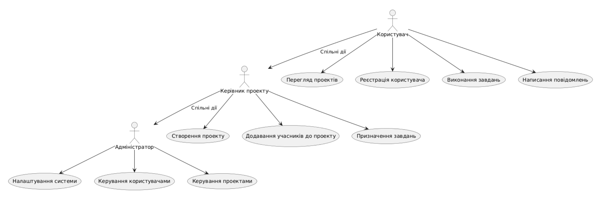
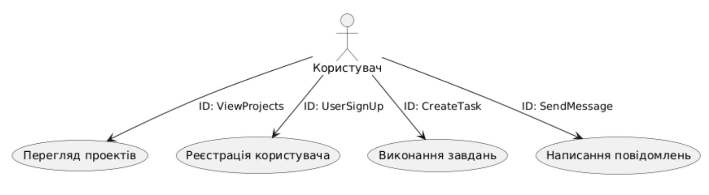
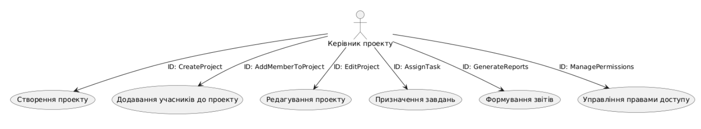
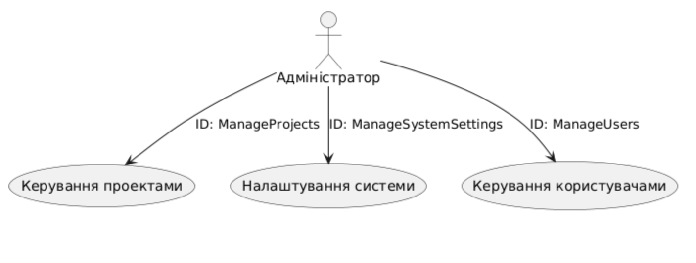

# Модель прецедентів

В цьому файлі необхідно перелічити всі документи, розроблені в проекті та дати посилання на них.

*Модель прецедентів повинна містити загальні оглядові діаграми та специфікації прецедентів.*

Вбудовування зображень діаграм здійснюється з використанням сервісу [plantuml.com](https://plantuml.com/). 

В markdown-файлі використовується опис діаграми

  
*Загальна схема*

  
*Схема користувача*

  
*Схема керівника*

  
*Схема адміністратора*

**Діаграма прецедентів**

| ID             | UserSignUp                             |
|----------------|----------------------------------------|
| Назва          | Реєстрація користувача                 |
| Учасники       | Користувач (учасник команди або розробник), система |
| Передумови     | Користувач не має облікового запису в системі |
| Результат      | Створено новий обліковий запис користувача |
| Виключні ситуації | Якщо не заповнені обов'язкові поля реєстрації — NullReferenceException  Якщо обліковий запис вже існує — UserAlreadyExistsException  Якщо пароль не відповідає вимогам безпеки — NotStrongPasswordException |
| Основний сценарій | 1. Користувач натискає кнопку "Створити обліковий запис".  2. Користувач заповнює реєстраційну форму.  3. Користувач натискає кнопку "Зареєструватися".  4. Система перевіряє коректність введених даних:     - Якщо дані некоректні, генерується NullReferenceException або NotStrongPasswordException.  5. Система перевіряє, чи існує обліковий запис з такими даними:     - Якщо запис вже існує, генерується UserAlreadyExistsException.  6. Якщо всі перевірки успішні, система створює новий обліковий запис.  7. Користувач переходить до свого новоствореного облікового запису. |

@startuml
|Користувач|
start
:Натискає кнопку "Створити обліковий запис";
:Заповнює реєстраційну форму;
:Натискає кнопку "Зареєструватися";

|Система|
:Виводить форму реєстрації;
:Перевіряє коректність введених даних;
if (Можливі помилки) then (NullReferenceException)
    :NullReferenceException;
else (NotStrongPasswordException)
    :NotStrongPasswordException;
endif

:Перевіряє, чи існує обліковий запис з такими даними;
if (Обліковий запис існує) then (UserAlreadyExistsException)
    :UserAlreadyExistsException;
else (Обліковий запис не існує)
    :Створює новий обліковий запис;
endif

|Користувач|
:Переходить до свого новоствореного облікового запису;
stop
@enduml

