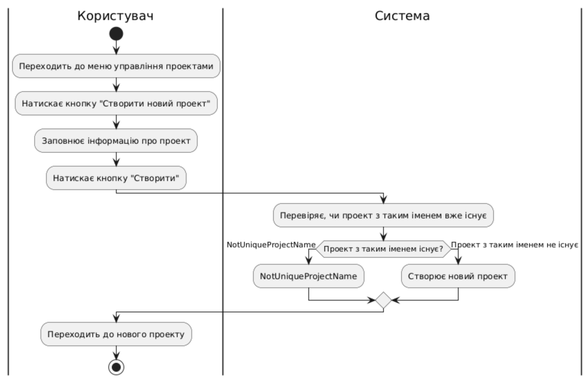

# Модель прецедентів

В цьому файлі необхідно перелічити всі документи, розроблені в проекті та дати посилання на них.

*Модель прецедентів повинна містити загальні оглядові діаграми та специфікації прецедентів.*

Вбудовування зображень діаграм здійснюється з використанням сервісу [plantuml.com](https://plantuml.com/). 

В markdown-файлі використовується опис діаграми

  
*Загальна схема*

  
*Схема користувача*

  
*Схема керівника*

  
*Схема адміністратора*

**Діаграма прецедентів**

| ID             | UserSignUp                             |
|----------------|----------------------------------------|
| Назва          | Реєстрація користувача                 |
| Учасники       | Користувач (учасник команди або розробник), система |
| Передумови     | Користувач не має облікового запису в системі |
| Результат      | Створено новий обліковий запис користувача |
| Виключні ситуації | Якщо не заповнені обов'язкові поля реєстрації — NullReferenceException  Якщо обліковий запис вже існує — UserAlreadyExistsException  Якщо пароль не відповідає вимогам безпеки — NotStrongPasswordException |
| Основний сценарій | 1. Користувач натискає кнопку "Створити обліковий запис".  2. Користувач заповнює реєстраційну форму.  3. Користувач натискає кнопку "Зареєструватися".  4. Система перевіряє коректність введених даних:     - Якщо дані некоректні, генерується NullReferenceException або NotStrongPasswordException.  5. Система перевіряє, чи існує обліковий запис з такими даними:     - Якщо запис вже існує, генерується UserAlreadyExistsException.  6. Якщо всі перевірки успішні, система створює новий обліковий запис.  7. Користувач переходить до свого новоствореного облікового запису. |

  
*****

| ID             | CreateTask                             |
|----------------|----------------------------------------|
| Назва          | Виконання завдань                      |
| Учасники       | Користувач (тімлід або робітник), система |
| Передумови     | Користувач авторизований              |
| Результат      | Завдання успішно виконано              |
| Виключні ситуації | Завдання не існує — TaskNotFoundException  Недостатньо прав для виконання завдання — AccessDeniedException |
| Основний сценарій | 1. Користувач вибирає завдання для виконання.  2. Користувач оновлює статус завдання (наприклад, "Завершено").  3. Система зберігає оновлений статус завдання. |

  
******

| ID             | ViewProjects                             |
|----------------|------------------------------------------|
| Назва          | Перегляд проектів                        |
| Учасники       | Користувач (учасник проекту), система   |
| Передумови     | Користувач авторизований                |
| Результат      | Проекти відображаються в інтерфейсі користувача |
| Виключні ситуації | Проекти не знайдені — ProjectsNotFoundException |
| Основний сценарій | 1. Користувач відкриває розділ проектів.  2. Система відображає список доступних проектів.  3. Користувач переглядає проекти, до яких має доступ. |

  
*****

| ID             | SendMessage                             |
|----------------|----------------------------------------|
| Назва          | Написання повідомлень                  |
| Учасники       | Користувач (учасник проекту), система |
| Передумови     | Користувач авторизований              |
| Результат      | Повідомлення відправлено              |
| Виключні ситуації | Повідомлення не надіслано — MessageFailedException |
| Основний сценарій | 1. Користувач вибирає контакт або групу для повідомлення.  2. Користувач вводить текст повідомлення.  3. Користувач натискає кнопку "Надіслати".  4. Система відправляє повідомлення. |

  
******

| ID             | CreateProject                             |
|----------------|-------------------------------------------|
| Назва          | Створення проекту                         |
| Учасники       | Користувач (тімлід), система             |
| Передумови     | Користувач авторизований                 |
| Результат      | Новий проект створено                    |
| Виключні ситуації | Проект з таким іменем вже існує — NotUniqueProjectName |
| Основний сценарій | 1. Користувач переходить до меню управління проектами.  2. Натискає кнопку "Створити новий проект".  3. Заповнює інформацію про проект.  4. Натискає кнопку "Створити".  5. Система перевіряє, чи проект з таким іменем вже існує:     - Якщо проект з таким іменем вже існує, генерується NotUniqueProjectName.  6. Якщо перевірка успішна, система створює новий проект.  7. Користувач переходить до нового проекту. |

  
****
| ID             | EditProject                             |
|----------------|-----------------------------------------|
| Назва          | Редагування проекту                    |
| Учасники       | Користувач (керівник проекту), адміністратор, система |
| Передумови     | Користувач авторизований               |
| Результат      | Дані проекту успішно змінені           |
| Виключні ситуації | Проект не знайдено — ProjectNotFoundException  Недостатньо прав для редагування — AccessDeniedException |
| Основний сценарій | 1. Користувач відкриває проект.  2. Натискає кнопку "Редагувати".  3. Вносить зміни до проекту.  4. Система перевіряє права на редагування.  5. Система зберігає зміни. |

  

*****

| ID             | AddMemberToProject                        |
|----------------|-------------------------------------------|
| Назва          | Додавання учасників до проекту            |
| Учасники       | Користувач (керівник проекту), адміністратор, система |
| Передумови     | Користувач авторизований                 |
| Результат      | Учасник успішно доданий до проекту        |
| Виключні ситуації | Користувача не знайдено — UserNotFoundException  Проект не знайдено — ProjectNotFoundException  Недостатньо прав для додавання учасника — AccessDeniedException |
| Основний сценарій | 1. Користувач відкриває проект.  2. Натискає кнопку "Додати учасника".  3. Вводить дані нового учасника.  4. Система перевіряє права на додавання учасника.  5. Система додає учасника до проекту. |

  
****

| ID             | AssignTask                               |
|----------------|------------------------------------------|
| Назва          | Призначення завдань                      |
| Учасники       | Користувач (керівник проекту), система  |
| Передумови     | Користувач авторизований                |
| Результат      | Завдання призначено учасникам проекту    |
| Виключні ситуації | Недостатньо прав для призначення завдання — AccessDeniedException |
| Основний сценарій | 1. Користувач створює завдання.  2. Призначає завдання конкретному користувачеві.  3. Встановлює дедлайн для виконання завдання. |

  
****
| ID             | GenerateReports                          |
|----------------|------------------------------------------|
| Назва          | Формування звітів                        |
| Учасники       | Користувач (керівник проекту), система  |
| Передумови     | Користувач авторизований                |
| Результат      | Генерація звітів по проекту              |
| Виключні ситуації | Не вдалося сформувати звіт — ReportGenerationException |
| Основний сценарій | 1. Користувач вибирає період для звіту.  2. Система генерує звіт по виконаних завданнях і прогресу проекту. |

  
****

| ID             | ManagePermissions                        |
|----------------|------------------------------------------|
| Назва          | Управління правами доступу              |
| Учасники       | Користувач (керівник проекту), система  |
| Передумови     | Користувач авторизований                |
| Результат      | Зміни в правах доступу для учасників проекту |
| Виключні ситуації | Недостатньо прав для зміни доступу — AccessDeniedException |
| Основний сценарій | 1. Користувач вибирає учасника.  2. Змінює його права доступу до проекту (наприклад, права на редагування або перегляд). |

  

*****

| ID             | ManageSystemSettings                      |
|----------------|-------------------------------------------|
| Назва          | Налаштування системи                     |
| Учасники       | Адміністратор, система                   |
| Передумови     | Користувач авторизований як адміністратор |
| Результат      | Налаштовані параметри системи            |
| Основний сценарій | 1. Адміністратор змінює налаштування системи (наприклад, мовні налаштування, налаштування безпеки тощо).  2. Система застосовує нові налаштування. |

  
****

| ID             | ManageUsers                             |
|----------------|-----------------------------------------|
| Назва          | Керування користувачами                 |
| Учасники       | Адміністратор, система                  |
| Передумови     | Користувач авторизований як адміністратор |
| Результат      | Керування обліковими записами користувачів |
| Основний сценарій | 1. Адміністратор додає нового користувача.  2. Адміністратор редагує або видаляє існуючого користувача. |

  
*****

| ID             | ManageProjects                         |
|----------------|----------------------------------------|
| Назва          | Керування проектами                    |
| Учасники       | Адміністратор, система                 |
| Передумови     | Користувач авторизований як адміністратор |
| Результат      | Зміни в проектах                       |
| Основний сценарій | 1. Адміністратор налаштовує доступ до проектів.  2. Адміністратор видаляє або архівує проекти. |

  
****

